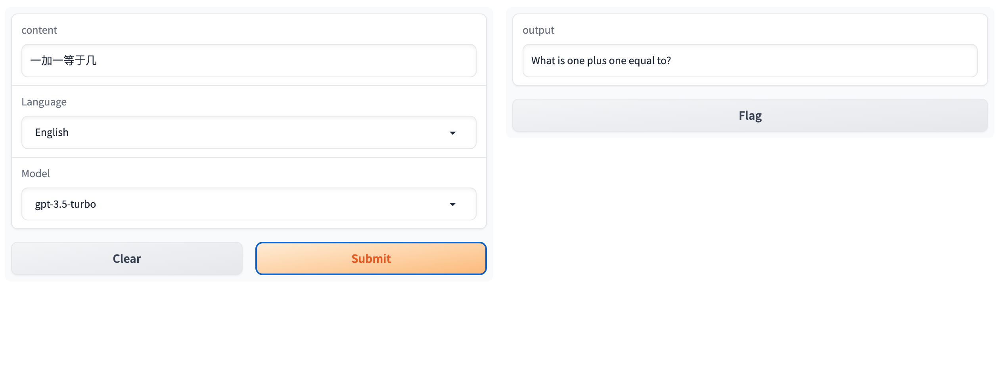
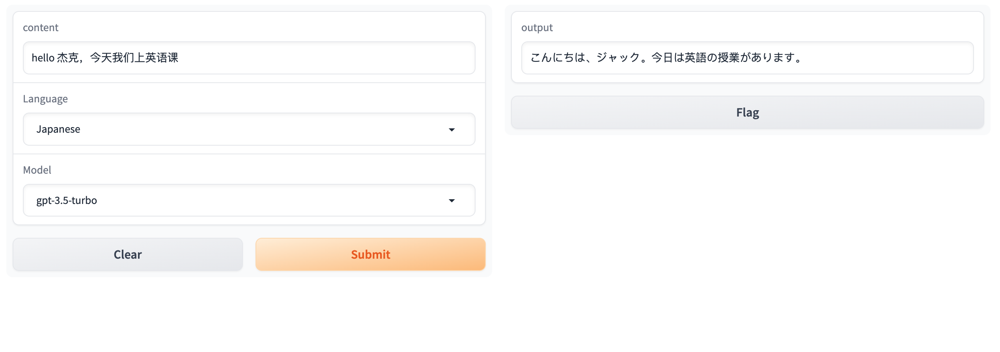

# gpt-stable-translator-demo

A GUI demo for a stable translator, backed by Gradio and OpenAI API.

# Intent

* The translator should be stable. It should only perform the translation task, not to be fooled by user's other requestions. 
* The translator is supposed to translate into any laguages.

# Environment Setup

Suggested python version: 3.11

`pip3 install -r requirements.txt`

# Run Demo

`gradio stable_translate_demo.py`

# Examples

